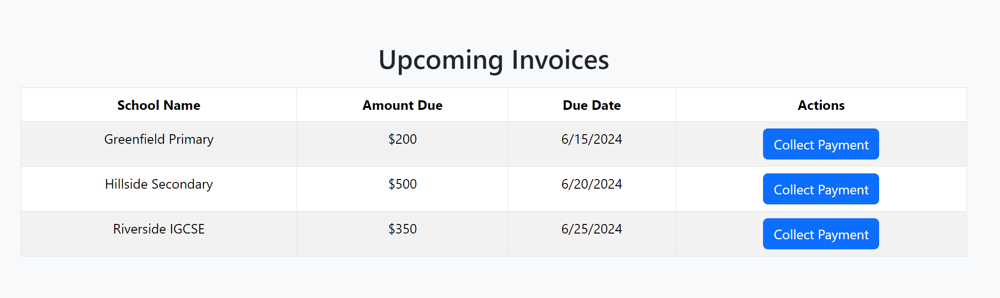

Sales-dashboard

Components i need

<ul>
<li>1.nav</li>
<li>2. dashboard</li>
<ul>
<li>Collections card<li>
<li>Sign-ups</li>
<li>Total Revenue</li>
<li>Bounced Cheques</li>
<li>Targets Visualization</li>
<li>Signups Overview Bar Graphs</li>
<li>Upcoming Invoices</li>
</ul>

<li>3. School Management</li>
<ul>
<li>School List:</li>
<li>Invoices</li>
<li>Collections</li>

</ul>

</ul>
<h2>Running This application</h2>
Clone this git repository
Use <em> git clone "link"</em>
Navigate to the Sales-dashboard folder using cmd and run <em> npm start</em>

You are now good to go!

The application is not completely finished.

